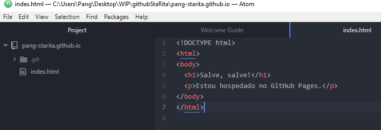

# Introdução ao GitHub Pages

## Site de Usuário ou de Empresa

1. Crie um repositório
   Vá para [GitHub](https://github.com) e crie um 
   [novo repositório](https://github.com/new)
   chamado de _nomeDoUsuário_.github.io, onde
   o _nomeDoUsuário_ é seu username (ou o nome da
   empresa) no GitHub. 
   
2. Clone o repositório com o GitHub Desktop (Mac ou MSWindows)
   
   
   
3. Crie um arquivo index.html no editor:
   
   
4. Commit e publique
   
   
   
5. Pronto.
   Teste acessando: https://pang-starita.github.io.